# DWG 自动排板处理流程

本文说明 CMS 接收 DXF 或 DWG 后，到生成排板图和材料清单为止的实际处理顺序，以及各阶段的主要逻辑判断。

## 执行入口

转换只通过 CMS 的 `POST /api/convert` 进入。用户先在转换工作台选择 `/settings` 中维护的预设，
CMS 将所选预设保存为当前任务的 `preset.json` 快照，再保持一个请求并按顺序启动独立 Python worker：

- AI 排版：`detect` → 人工复核 → AI 吊顶全局策略 `layout` → 本地精确排板 `generate`
- 本地排版：`detect` → 人工复核 → `generate`

`detect` 使用本地规则并将墙体、门窗候选保存到任务目录的 `conversion_checkpoint.json`；用户复核后，`layout` 请求 AI 给出吊顶房间分组和排版方向；`generate` 再由本地算法完成墙板、吊顶的精确计算并生成最终文件。

## 完整流程图

```mermaid
flowchart TD
    start([CMS 接收转换请求]) --> preset[读取并保存所选预设快照]
    preset --> detectWorker[启动 detect worker]
    detectWorker --> args[读取阶段参数与环境配置]

    subgraph inputPhase ["一、输入与读取"]
        args --> fileExists{"CAD 文件存在?"}
        fileExists -->|否| fileError([报错并终止])
        fileExists -->|是| fileType{"文件类型?"}
        fileType -->|其他| typeError([仅支持 DWG 或 DXF])
        fileType -->|DWG| converter{"已安装 dwg2dxf?"}
        converter -->|否| converterError([提示安装 LibreDWG])
        converter -->|是| convert[转换为同目录同名 DXF]
        convert --> readCad[读取 DXF]
        fileType -->|DXF| readCad
        readCad --> structureValid{"DXF 结构可正常读取?"}
        structureValid -->|否| recover[使用 recover 尝试修复读取]
        structureValid -->|是| cleanInsert[移除引用缺失块的 INSERT]
        recover --> cleanInsert
    end

    subgraph detectionPhase ["二、墙体与洞口候选提取"]
        cleanInsert --> colorScope[仅保留配置颜色的可见实体]
        colorScope --> extractGeometry[展开嵌套块并提取直线几何]
        extractGeometry --> curveCheck{"存在圆弧墙段或 bulge?"}
        curveCheck -->|是| skipCurve[跳过并累计数量]
        curveCheck -->|否| openingMatch[匹配门窗几何]
        skipCurve --> openingMatch
        openingMatch --> mergeFaces[合并重复、共线、连续墙面线]
        mergeFaces --> pairCheck{"满足可靠双线条件?"}
        pairCheck -->|否| rejectFace[不作为墙体候选]
        pairCheck -->|是| buildAxis[生成墙中心轴]
        buildAxis --> mergeAxis[按连续性和门窗覆盖关系合并]
        mergeAxis --> splitWall[按 L、T、X 交接计算内墙皮净端点并分段]
        splitWall --> assignId[稳定排序并编号 W0001、W0002…]
        assignId --> hasCandidate{"存在墙体候选?"}
        hasCandidate -->|否| candidateError([报错并终止])
    end

    subgraph recognitionPhase ["三、人工复核与排版选择"]
        hasCandidate -->|是| review[调整墙体、门和窗]
        review --> layoutMode{"排版方式?"}
        layoutMode -->|本地模型| acceptedWalls[采用本地排版策略]
        layoutMode -->|AI| envReady{"AI 环境变量齐全?"}
        envReady -->|否| envError([报错并返回复核页])
        envReady -->|是| requestAi[发送房间边界和邻接关系供 AI 全局规划]
        requestAi --> responseValid{"房间分组完整、连通且方向有效?"}
        responseValid -->|否| aiError([报错并返回复核页])
        responseValid -->|是| acceptedWalls
    end

    subgraph layoutPhase ["四、排板、绘图与输出"]
        acceptedWalls --> loadMaterials[读取任务预设中的材料与标注参数]
        loadMaterials --> configValid{"预设参数有效?"}
        configValid -->|否| configError([报错并终止])
        configValid -->|是| saveDetected[输出 detected_walls.dxf]
        saveDetected --> nextWall[逐墙计算内墙皮净长度]
        nextWall --> exactLayout{"存在全标准板精确方案?"}
        exactLayout -->|是| chooseExact[优先主板更多、板数更少的方案]
        exactLayout -->|否| cutLayout[计算单端或双端非标板方案]
        cutLayout --> cutValid{"满足最小板宽、模数和尾差?"}
        cutValid -->|否| layoutError([该墙段无法排板并终止])
        cutValid -->|是| chooseCut[优先主板、标准板占比和对称收边]
        chooseExact --> draw[绘制板宽文字和贯穿墙厚的板缝]
        chooseCut --> draw
        draw --> moreWall{"还有墙段?"}
        moreWall -->|是| nextWall
        moreWall -->|否| saveResult[保存排板 DXF]
        saveResult --> schedule[生成 CSV 和 JSON 材料清单]
        schedule --> finish([完成])
    end

    style inputPhase fill:#C2E5FF,stroke:#3DADFF
    style detectionPhase fill:#DCCCFF,stroke:#874FFF
    style recognitionPhase fill:#FFECBD,stroke:#FFC943
    style layoutPhase fill:#CDF4D3,stroke:#66D575
```

## 关键逻辑判断

| 阶段 | 判断内容 | 当前规则 |
| --- | --- | --- |
| DWG 读取 | 是否可直接读取 | DWG 必须先通过 LibreDWG 的 `dwg2dxf` 转成 R2013 DXF；DXF 可直接读取 |
| 可见性 | 实体是否参与候选提取 | 关闭或冻结图层上的实体不参与；普通嵌套块会递归展开 |
| 直墙 | 是否支持该几何 | 读取 `LINE` 和无圆弧段的 `LWPOLYLINE/POLYLINE`；带 bulge 的段跳过 |
| 设置预设 | 参数从哪里读取 | 每次任务使用开始转换时所选预设的快照；之后修改预设不会改变已开始的任务 |
| 本地颜色 | 是否提取墙面线 | 只取预设颜色，默认 ACI `1、6` |
| 双线墙 | 两条线能否组成墙 | 墙厚接近预设值，默认 `50、75、100 mm` 且允许 `±10 mm`；投影重合度默认至少 `90%`；双方互为最近的有效平行线；有效重合长度默认至少 `300 mm` |
| 窗洞 | 是否匹配为窗 | 至少四条同方向、同跨距的平行窗框线，宽度在 `300–3000 mm` |
| 门洞 | 是否匹配为门 | 一个开启圆弧，加至少两条长度接近圆弧半径并与圆弧端点对齐的直线，宽度在 `300–3000 mm` |
| 跨洞合并 | 断开的墙段能否合并 | 只有门窗几何连续覆盖断口时才合并，洞口边框允许最多 `300 mm` 间隙 |
| 交接点 | 墙段如何截断 | L 型取内墙皮净端；T 型支墙端预留默认 `5 mm`，主墙不断开；X 型按相交墙内侧边界分段 |
| AI 排版 | 模型可以决定什么 | 只决定吊顶房间分组、走廊独立和长短边方向；板材尺寸、数量、坐标、拼缝、校验和出图仍由本地程序控制 |
| 模型思考 | 默认是否开启 | 默认关闭，在设置预设中按模型能力开启 |
| 洞口排板 | 是否在门窗处重新起排 | 门窗作为空区不排板；洞口两侧的实际墙面分别重新起排 |
| 精确排板 | 首选什么方案 | 优先全部由标准板组成，并优先使用更多 `primary_width` 主板，其次减少板数 |
| 非标排板 | 无精确方案时如何选 | 常规非标板不得小于默认 `150 mm`；门窗切分后不足该宽度的真实墙面直接作为收边板。其余非标板按默认 `5 mm` 模数归整，尾差不得超过默认 `±2.5 mm`；同等条件优先主板更多、标准板占比更高、双端对称收边、板数更少 |

## 输出文件

- `data/jobs/<任务号>/panel_layout_result.dxf`：保留原图，并新增板宽文字和板缝。
- `data/jobs/<任务号>/detected_walls.dxf`：参与计算的墙体、门窗洞口及低置信度对象。
- `data/jobs/<任务号>/panel_schedule.csv`：材料统计表。
- `data/jobs/<任务号>/panel_schedule.json`：JSON 格式材料统计。
- `data/jobs/<任务号>/preset.json`：本次任务实际使用的设置预设快照。

AI 原始策略结果和返回日志只保存在服务端任务目录中，不通过文件接口提供下载。

发生输入错误、配置错误、AI 返回无效、没有可用墙段或某个墙段无法满足排板约束时，当前 worker 会立即终止，CMS 返回具体原因且不启动后续阶段。
